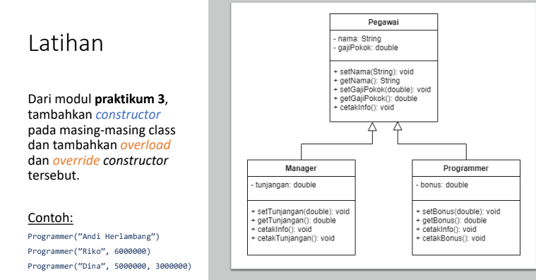

# Praktikum5

# Latihan



# Code
```
class Pegawai {
    protected String nama;
    protected double gajiPokok;

    // Konstruktor default
    public Pegawai() {
        this.nama = "Tidak Diketahui";
        this.gajiPokok = 0.0;
    }

    // Konstruktor dengan parameter
    public Pegawai(String nama, double gajiPokok) {
        this.nama = nama;
        this.gajiPokok = gajiPokok;
    }

    public String getNama() {
        return nama;
    }

    public double getGajiPokok() {
        return gajiPokok;
    }

    public void cetakInfo() {
        System.out.println("Nama: " + nama);
        System.out.println("Gaji Pokok: " + gajiPokok);
    }
}

class Manager extends Pegawai {
    private double tunjangan;

    // Konstruktor default
    public Manager() {
        super();
        this.tunjangan = 0.0;
    }

    // Konstruktor overload
    public Manager(String nama, double gajiPokok, double tunjangan) {
        super(nama, gajiPokok);
        this.tunjangan = tunjangan;
    }

    public void setTunjangan(double tunjangan) {
        this.tunjangan = tunjangan;
    }

    public double getTunjangan() {
        return tunjangan;
    }

    @Override
    public void cetakInfo() {
        super.cetakInfo();
        System.out.println("Tunjangan: " + tunjangan);
    }
}

class Programmer extends Pegawai {
    private double bonus;

    // Konstruktor default
    public Programmer() {
        super();
        this.bonus = 0.0;
    }

    // Konstruktor overload
    public Programmer(String nama, double gajiPokok, double bonus) {
        super(nama, gajiPokok);
        this.bonus = bonus;
    }

    public void setBonus(double bonus) {
        this.bonus = bonus;
    }

    public double getBonus() {
        return bonus;
    }

    @Override
    public void cetakInfo() {
        super.cetakInfo();
        System.out.println("Bonus: " + bonus);
    }
}

public class Main {
    public static void main(String[] args) {
        // Pengujian konstruktor
        Programmer p1 = new Programmer("Andi Herlambang", 0, 0);
        Programmer p2 = new Programmer("Riko", 6000000, 0);
        Programmer p3 = new Programmer("Dina", 5000000, 3000000);

        p1.cetakInfo();
        p2.cetakInfo();
        p3.cetakInfo();
    }
}
```
# Penjelasan

***Kelas Pegawai***: Memiliki konstruktor default dan konstruktor dengan parameter. Metode ```cetakInfo()``` mencetak nama pegawai dan gaji pokok.

***Kelas Manager***: Mewarisi dari kelas ```Pegawai``` dan menambahkan atribut ```tunjangan```. Memiliki konstruktor default dan konstruktor overload. Metode ```cetakInfo()``` di-override untuk menyertakan informasi ```tunjangan```.

***Kelas Programmer***: Mewarisi dari kelas ```Pegawai``` dan menambahkan atribut ```bonus```. Juga memiliki konstruktor default dan konstruktor overload. Metode ```cetakInfo()``` di-override untuk menyertakan informasi ```bonus```.
