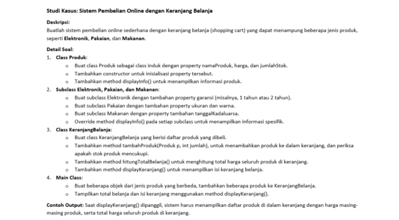

# Praktikum5

# Latihan


# Code Program Java
```
class Pegawai {
    protected String nama;
    protected double gajiPokok;

    // Konstruktor default
    public Pegawai() {
        this.nama = "Tidak Diketahui";
        this.gajiPokok = 0.0;
    }

    // Konstruktor dengan parameter
    public Pegawai(String nama, double gajiPokok) {
        this.nama = nama;
        this.gajiPokok = gajiPokok;
    }

    public String getNama() {
        return nama;
    }

    public double getGajiPokok() {
        return gajiPokok;
    }

    public void cetakInfo() {
        System.out.println("Nama: " + nama);
        System.out.println("Gaji Pokok: " + gajiPokok);
    }
}

class Manager extends Pegawai {
    private double tunjangan;

    // Konstruktor default
    public Manager() {
        super();
        this.tunjangan = 0.0;
    }

    // Konstruktor overload
    public Manager(String nama, double gajiPokok, double tunjangan) {
        super(nama, gajiPokok);
        this.tunjangan = tunjangan;
    }

    public void setTunjangan(double tunjangan) {
        this.tunjangan = tunjangan;
    }

    public double getTunjangan() {
        return tunjangan;
    }

    @Override
    public void cetakInfo() {
        super.cetakInfo();
        System.out.println("Tunjangan: " + tunjangan);
    }
}

class Programmer extends Pegawai {
    private double bonus;

    // Konstruktor default
    public Programmer() {
        super();
        this.bonus = 0.0;
    }

    // Konstruktor overload
    public Programmer(String nama, double gajiPokok, double bonus) {
        super(nama, gajiPokok);
        this.bonus = bonus;
    }

    public void setBonus(double bonus) {
        this.bonus = bonus;
    }

    public double getBonus() {
        return bonus;
    }

    @Override
    public void cetakInfo() {
        super.cetakInfo();
        System.out.println("Bonus: " + bonus);
    }
}

public class Main {
    public static void main(String[] args) {
        // Pengujian konstruktor
        Programmer p1 = new Programmer("Andi Herlambang", 0, 0);
        Programmer p2 = new Programmer("Riko", 6000000, 0);
        Programmer p3 = new Programmer("Dina", 5000000, 3000000);

        p1.cetakInfo();
        p2.cetakInfo();
        p3.cetakInfo();
    }
}
```
# Penjelasan

***Kelas Pegawai***: Memiliki konstruktor default dan konstruktor dengan parameter. Metode ```cetakInfo()``` mencetak nama pegawai dan gaji pokok.

***Kelas Manager***: Mewarisi dari kelas ```Pegawai``` dan menambahkan atribut ```tunjangan```. Memiliki konstruktor default dan konstruktor overload. Metode ```cetakInfo()``` di-override untuk menyertakan informasi ```tunjangan```.

***Kelas Programmer***: Mewarisi dari kelas ```Pegawai``` dan menambahkan atribut ```bonus```. Juga memiliki konstruktor default dan konstruktor overload. Metode ```cetakInfo()``` di-override untuk menyertakan informasi ```bonus```.
# Output


# Studi Kasus



# Code Program Java
```
import java.util.ArrayList;

// Class Produk sebagai class induk
class Produk {
    protected String namaProduk;
    protected double harga;
    protected int jumlahStok;

    public Produk(String namaProduk, double harga, int jumlahStok) {
        this.namaProduk = namaProduk;
        this.harga = harga;
        this.jumlahStok = jumlahStok;
    }

    public void displayInfo() {
        System.out.println("Nama Produk: " + namaProduk);
        System.out.println("Harga: " + harga);
        System.out.println("Stok: " + jumlahStok);
    }

    public String getNamaProduk() {
        return namaProduk;
    }

    public double getHarga() {
        return harga;
    }

    public int getJumlahStok() {
        return jumlahStok;
    }

    public void kurangiStok(int jumlah) {
        if (jumlah <= jumlahStok) {
            jumlahStok -= jumlah;
        }
    }
}

// Subclass Elektronik
class Elektronik extends Produk {
    private int garansi; // Garansi dalam tahun

    public Elektronik(String namaProduk, double harga, int jumlahStok, int garansi) {
        super(namaProduk, harga, jumlahStok);
        this.garansi = garansi;
    }

    @Override
    public void displayInfo() {
        super.displayInfo();
        System.out.println("Garansi: " + garansi + " tahun");
    }
}

// Subclass Pakaian
class Pakaian extends Produk {
    private String ukuran;
    private String warna;

    public Pakaian(String namaProduk, double harga, int jumlahStok, String ukuran, String warna) {
        super(namaProduk, harga, jumlahStok);
        this.ukuran = ukuran;
        this.warna = warna;
    }

    @Override
    public void displayInfo() {
        super.displayInfo();
        System.out.println("Ukuran: " + ukuran);
        System.out.println("Warna: " + warna);
    }
}

// Subclass Makanan
class Makanan extends Produk {
    private String tanggalKadaluarsa;

    public Makanan(String namaProduk, double harga, int jumlahStok, String tanggalKadaluarsa) {
        super(namaProduk, harga, jumlahStok);
        this.tanggalKadaluarsa = tanggalKadaluarsa;
    }

    @Override
    public void displayInfo() {
        super.displayInfo();
        System.out.println("Tanggal Kadaluarsa: " + tanggalKadaluarsa);
    }
}

// Class KeranjangBelanja
class KeranjangBelanja {
    private ArrayList<Produk> daftarProduk;
    private ArrayList<Integer> jumlahBeli;

    public KeranjangBelanja() {
        daftarProduk = new ArrayList<>();
        jumlahBeli = new ArrayList<>();
    }

    public void tambahProduk(Produk p, int jumlah) {
        if (p.getJumlahStok() >= jumlah) {
            daftarProduk.add(p);
            jumlahBeli.add(jumlah);
            p.kurangiStok(jumlah);
            System.out.println("Produk " + p.getNamaProduk() + " berhasil ditambahkan ke keranjang.");
        } else {
            System.out.println("Stok produk " + p.getNamaProduk() + " tidak mencukupi.");
        }
    }

    public double hitungTotalBelanja() {
        double total = 0;
        for (int i = 0; i < daftarProduk.size(); i++) {
            total += daftarProduk.get(i).getHarga() * jumlahBeli.get(i);
        }
        return total;
    }

    public void displayKeranjang() {
        System.out.println("\nIsi Keranjang Belanja:");
        for (int i = 0; i < daftarProduk.size(); i++) {
            Produk produk = daftarProduk.get(i);
            int jumlah = jumlahBeli.get(i);
            produk.displayInfo();
            System.out.println("Jumlah Beli: " + jumlah);
            System.out.println("Total Harga: " + (produk.getHarga() * jumlah));
            System.out.println("--------------------------");
        }
        System.out.println("Total Belanja: " + hitungTotalBelanja());
    }
}

// Main Class
public class Main {
    public static void main(String[] args) {
        // Membuat objek produk
        Elektronik laptop = new Elektronik("Laptop", 4000000, 5, 2);
        Pakaian kaos = new Pakaian("Kaos", 150000, 10, "L", "Hitam");
        Makanan roti = new Makanan("Roti", 20000, 20, "2024-12-01");

        // Membuat objek keranjang belanja
        KeranjangBelanja keranjang = new KeranjangBelanja();

        // Menambahkan produk ke keranjang
        keranjang.tambahProduk(laptop, 2);
        keranjang.tambahProduk(kaos, 3);
        keranjang.tambahProduk(roti, 5);

        // Menampilkan isi keranjang dan total belanja
        keranjang.displayKeranjang();
    }
}
```
# Penjelasan
***Class Produk:*** Class induk dengan atribut ```namaProduk```, ```harga```, dan ```jumlahStok```. Method ```displayInfo()``` menampilkan informasi produk, dan ```kurangiStok()``` mengurangi stok produk sesuai jumlah yang dibeli.

***Subclass Elektronik, Pakaian, dan Makanan***:

Elektronik: Menambahkan atribut garansi dan menampilkan informasi ```garansi``` di ```displayInfo()```.
Pakaian: Menambahkan atribut ```ukuran``` dan ```warna```, serta menampilkan informasi tambahan ini di ```displayInfo()```.
Makanan: Menambahkan atribut ```tanggalKadaluarsa``` dan menampilkan tanggal kadaluarsa di ```displayInfo()```.

***Class KeranjangBelanja***: Mengelola daftar produk yang dibeli dan jumlah setiap produk. Metode ```tambahProduk()``` menambahkan produk jika stok mencukupi, ```hitungTotalBelanja()``` menghitung total harga, dan ```displayKeranjang()``` menampilkan isi keranjang beserta total belanja.

***Main Class***: Membuat objek dari berbagai jenis produk, menambahkannya ke ```KeranjangBelanja```, dan menampilkan total belanja serta isi keranjang.

# Output


